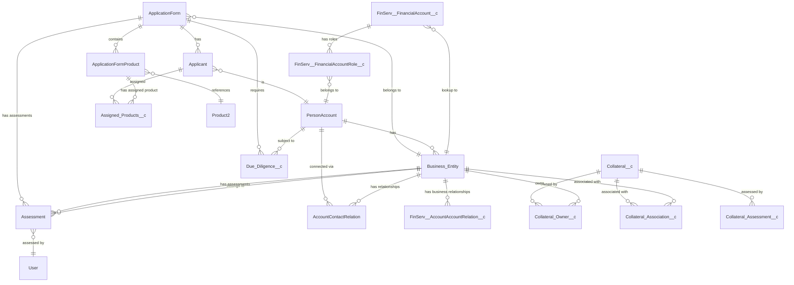

# Main Street Bank – FSC +  Data Model

> **Legend**  
> 🟦 Standard Salesforce Object  
> 🟧 FSC Object  
> 🟩 Custom Object  

---

## View 1: High-Level Flow

This view shows the entity relationships for deposit account opening workflow.

### Entity Relationship Diagram



---

## Object Relationships

### Core Objects

| Object | Type | Description | Key Relationships |
|--------|------|-------------|-------------------|
| **ApplicationForm** | 🟧 FSC | Primary deposit application | → Applicant, ApplicationFormProduct, Due_Diligence__c, Assessment |
| **Applicant** | 🟧 FSC | Individual applicants | → PersonAccount, ApplicationForm, Assigned_Products__c |
| **PersonAccount** | 🟦 Standard | Customer records | → Business_Entity, Due_Diligence__c, AccountContactRelation |
| **Business_Entity** | 🟦 Standard | Business accounts | → ApplicationForm, FinServ__FinancialAccount__c, Collateral objects, Assessment, AccountContactRelation |
| **AccountContactRelation** | 🟦 Standard | Person-to-Business relationships | → PersonAccount (Contact), Business_Entity (Account) |
| **FinServ__FinancialAccount__c** | 🟧 FSC | Deposit/loan account | → FinServ__FinancialAccountRole__c, Business_Entity |
| **Due_Diligence__c** | 🟩 Custom | Compliance tracking | → ApplicationForm, PersonAccount |
| **Assessment** | 🟩 Custom | Assessment tracking | → ApplicationForm, Business_Entity, User |

###  Integration Objects

| Object | Type | Description | External ID Field |
|--------|------|-------------|-------------------|
| **ApplicationForm** | 🟧 FSC | Application data | `DAOApplicationId__c` |
| **Applicant** | 🟧 FSC | Applicant data | `DAOApplicantId__c` |
| **Account** | 🟦 Standard | Business data | `DAOBusinessId__c` |

### Collateral Objects

| Object | Type | Description | Key Relationships |
|--------|------|-------------|-------------------|
| **Collateral__c** | 🟩 Custom | Collateral items | ← Collateral_Owner__c, Collateral_Association__c, Collateral_Assessment__c |
| **Collateral_Owner__c** | 🟩 Custom | Collateral ownership | → Collateral__c, Business_Entity |
| **Collateral_Association__c** | 🟩 Custom | Collateral associations | → Collateral__c, Business_Entity |
| **Collateral_Assessment__c** | 🟩 Custom | Collateral valuations | → Collateral__c, User |

### Junction/Relationship Objects

| Object | Type | Description | Key Relationships |
|--------|------|-------------|-------------------|
| **AccountContactRelation** | 🟦 Standard | Links PersonAccount to Business Account | → Contact/PersonAccount, Account (Business) |
| **FinServ__FinancialAccountRole__c** | 🟧 FSC | Links PersonAccount to FinancialAccount | → PersonAccount, FinServ__FinancialAccount__c |
| **Assigned_Products__c** | 🟩 Custom | Links Applicant to ApplicationFormProduct | → Applicant, ApplicationFormProduct |

### Product Objects

| Object | Type | Description | Key Relationships |
|--------|------|-------------|-------------------|
| **Product2** | 🟦 Standard | Deposit products | ← ApplicationFormProduct |
| **ApplicationFormProduct** | 🟧 FSC | Product applications | → ApplicationForm, Product2, Assigned_Products__c |

---

## Data Flow

### 1. Application Creation
```
 → ApplicationForm → Applicant → PersonAccount
```

### 2. Compliance Workflow
```
ApplicationForm (Submitted) → Due_Diligence__c → Tasks
```

### 3. Assessment Workflow
```
ApplicationForm (Submitted) → Assessment → Results → ApplicationForm (Updated)
```

### 4. Financial Account Setup
```
ApplicationForm → FinServ__FinancialAccount__c → FinServ__FinancialAccountRole__c
```

### 5. Collateral Management
```
Business_Entity → Collateral_Owner__c → Collateral__c → Collateral_Assessment__c
```

### 6. Relationship Management
```
PersonAccount → AccountContactRelation → Business Account
Business Account → FinServ__AccountAccountRelation__c → Related Business Account
```

---

## Key Fields

### ApplicationForm
- `DAOApplicationId__c` (External ID from )
- `Stage` (Submitted, In Review, Approved, etc.)
- `AccountId` (Lookup to Account Business)

### Applicant
- `DAOApplicantId__c` (External ID from )
- `ApplicationForm` (Master-Detail to ApplicationForm)
- `AccountId` (Lookup to Account)
- `Applicant_Type__c` (Role of applicant)

### Account (Business Record Type)
- `DAOBusinessId__c` (External ID from )
- `Name` (Business Name)
- `Business_Type__c` (Entity Type)
- `NAICS_Code__c` (Industry Code)

### Account (PersonAccount)
- `LastName` 
- `PersonMailingAddress` 
- `PersonOtherAddress`

### Due_Diligence__c
- `ApplicationForm__c` (Lookup to ApplicationForm)
- `Type__c` (SAM, CAIVRS, Affiliate, KYC/KYB)
- `Status__c` (Completed, In Progress, Failed)
- `Completed_Date__c` (Completion timestamp)

### Assigned_Products__c
- `ApplicationFormProduct__c` (Lookup to ApplicationFormProduct)
- `Applicant__c` (Lookup to Applicant)

### Collateral__c
- `Type__c` (Real Estate, Equipment, Vehicle, etc.)
- `Value__c` (Estimated value)
- `Status__c` (Pending, Approved, Rejected)

### AccountContactRelation
- `AccountId` (Lookup to Account/Business)
- `ContactId` (Lookup to Contact/PersonAccount)
- `Roles` (Picklist: CEO, CFO, Owner, etc.)
- `Ownership_Percentage_zen__c` (0-100%)
- `Beneficial_Owner_zen__c` (Checkbox)
- `Authorized_Signer_zen__c` (Checkbox)
- `Controlling_Party_zen__c` (Checkbox)

---

## Notes

- All PII fields are encrypted at rest
- External ID fields enable data deduplication
- Account represents both Business and PersonAccount (via Record Type)
- Assigned_Products__c serves as junction between ApplicationFormProduct and Applicant
- **AccountContactRelation**: Standard junction connecting persons to business accounts
- The `entity` field in  API determines which junction object to use

---

**Created**: 2025-01-16  
**Last Updated**: 2025-01-16  
**Next Review**: Weekly during implementation  
**Stakeholders**: Development Team, QA Team, Product Team

