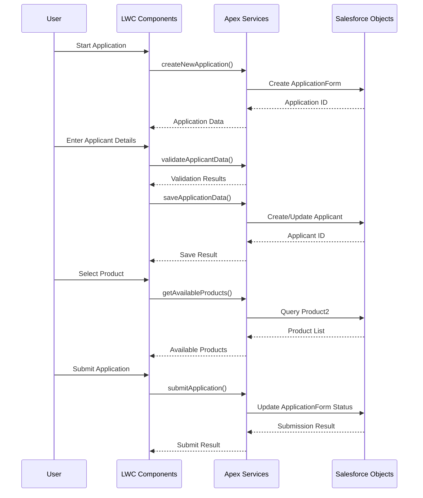

<!-- 
🔴 AI AGENTS: READ FIRST - /docs/01-foundation/data-model.md for correct object names
✅ Correct: ApplicationForm, Applicant, Account (Business), FinancialAccount
❌ Wrong: Application__c, Applicant__c, Loan__c, Business_Relationship__c
-->

# Salesforce User Workflow - Main Street Bank

**Workflow Type**: Deposit Account Opening - Salesforce User Journey  
**Last Updated**: 2025-01-16  
**Purpose**: Document the step-by-step user journey within Salesforce using LWC components

---

## 🎯 Overview

This document outlines the deposit account opening process as experienced by Salesforce users (bank staff or customers) through the LWC-based interface.

**User Types**: 
- Bank Staff (Assisted Application)
- Customer (Self-Service Application)

**Estimated Time**: 15-30 minutes  
**Steps**: 4 main steps + status monitoring

---

## 📋 User Journey Steps

### Step 1: Application Initialization

**Screen**: `daoApplicationFlow` - Application Start  
**Purpose**: Initialize new application or resume existing application

**User Actions**:
1. Navigate to Deposit Account Opening app
2. Click "Start New Application" or "Resume Application"
3. System creates new ApplicationForm record
4. User proceeds to Step 1

**System Actions**:
- Create new `ApplicationForm` record
- Initialize application data structure
- Set initial status to "Draft"
- Generate unique application ID

**Navigation**:
- **Next**: Step 1 - Applicant Details
- **Back**: N/A (first step)
- **Save & Exit**: Application saved as draft

---

### Step 2: Applicant Information Entry

**Screen**: `applicantDetails` component  
**Purpose**: Collect applicant personal and contact information

**Input Fields**:

| Field Name | Label | Type | Required | Validation | Maps To |
|------------|-------|------|----------|------------|---------|
| `firstName` | First Name | Text | Yes | Max 50 chars | Applicant.FirstName |
| `lastName` | Last Name | Text | Yes | Max 50 chars | Applicant.LastName |
| `email` | Email Address | Email | Yes | Valid email format | Applicant.Email |
| `phone` | Phone Number | Phone | Yes | 10-digit US phone | Applicant.Phone |
| `dateOfBirth` | Date of Birth | Date | Yes | Valid date, 18+ years | Applicant.Birthdate |
| `ssn` | Social Security Number | Text | Yes | 9-digit format | Applicant.SSN__c (encrypted) |
| `address` | Street Address | Text | Yes | Max 255 chars | Applicant.BillingAddress |
| `city` | City | Text | Yes | Max 50 chars | Applicant.BillingCity |
| `state` | State | Picklist | Yes | US state codes | Applicant.BillingState |
| `zipCode` | ZIP Code | Text | Yes | 5 or 9 digit format | Applicant.BillingPostalCode |

**Business Logic**:
- Real-time field validation
- SSN encryption before storage
- Address standardization
- Duplicate applicant checking

**Validation Rules**:
- All required fields must be completed
- Email format validation
- Phone number format validation
- Age verification (18+ years)
- SSN format validation

**Navigation**:
- **Next**: Step 2 - Product Selection
- **Back**: Application Start
- **Save & Exit**: Application saved as draft

---

### Step 3: Product Selection

**Screen**: `productSelection` component  
**Purpose**: Present available products and handle selection

**User Actions**:
1. View available deposit products
2. Review product recommendations
3. Compare product features
4. Select preferred product
5. Review product terms and conditions

**Product Information Displayed**:

| Field | Source | Display |
|-------|--------|---------|
| Product Name | Product2.Name | Primary heading |
| Description | Product2.Description | Product overview |
| Interest Rate | Product2.Interest_Rate__c | Current rate |
| Minimum Balance | Product2.Minimum_Balance__c | Required minimum |
| Monthly Fee | Product2.Monthly_Fee__c | Fee structure |
| Features | Product2.Features__c | Key benefits |

**Business Logic**:
- Product eligibility checking based on applicant profile
- Interest rate calculations
- Fee structure explanation
- Terms and conditions display

**Validation Rules**:
- Product must be available for applicant type
- Minimum requirements must be met
- Terms acceptance required

**Navigation**:
- **Next**: Step 3 - Collateral Entry (if required)
- **Back**: Step 1 - Applicant Details
- **Save & Exit**: Application saved as draft

---

### Step 4: Collateral Information

**Screen**: `collateralEntry` component  
**Purpose**: Collect collateral information for secured products

**Input Fields**:

| Field Name | Label | Type | Required | Validation | Maps To |
|------------|-------|------|----------|------------|---------|
| `collateralType` | Collateral Type | Picklist | Yes | Predefined values | Collateral__c.Type__c |
| `description` | Description | Text | Yes | Max 255 chars | Collateral__c.Description__c |
| `estimatedValue` | Estimated Value | Currency | Yes | > $0 | Collateral__c.Value__c |
| `ownershipPercentage` | Ownership % | Number | Yes | 1-100 | Collateral_Owner__c.Ownership_Percentage__c |
| `address` | Property Address | Text | No | Max 255 chars | Collateral__c.Address__c |

**Business Logic**:
- Multiple collateral items supported
- Value validation against loan amount
- Ownership percentage verification
- Collateral type-specific validations

**Validation Rules**:
- At least one collateral item required for secured products
- Estimated value must be reasonable
- Ownership percentage must total 100% if multiple owners

**Navigation**:
- **Next**: Step 4 - Review & Submit
- **Back**: Step 2 - Product Selection
- **Save & Exit**: Application saved as draft

---

### Step 5: Review and Submit

**Screen**: `reviewAndSubmit` component  
**Purpose**: Final review and submission of application

**Review Sections**:

1. **Applicant Information Summary**
   - Personal details
   - Contact information
   - Address information

2. **Selected Product Summary**
   - Product details
   - Interest rate and fees
   - Terms and conditions

3. **Collateral Summary** (if applicable)
   - Collateral items
   - Estimated values
   - Ownership details

4. **Document Checklist**
   - Required documents
   - Upload status
   - Verification status

**User Actions**:
1. Review all application information
2. Accept terms and conditions
3. Confirm accuracy of information
4. Submit application for processing

**Business Logic**:
- Complete data validation
- Document verification
- Compliance checking
- Final business rule validation

**Validation Rules**:
- All required information complete
- Terms and conditions accepted
- Documents uploaded and verified
- Business rules satisfied

**Navigation**:
- **Submit**: Application submitted for processing
- **Back**: Step 3 - Collateral Entry
- **Save & Exit**: Application saved as draft

---

### Step 6: Application Status Tracking

**Screen**: `applicationStatus` component  
**Purpose**: Monitor application progress and status

**Status Information**:

| Status | Description | Next Steps |
|--------|-------------|------------|
| Draft | Application in progress | Complete required steps |
| Submitted | Application received | Awaiting initial review |
| Under Review | Application being processed | Awaiting decision |
| Approved | Application approved | Account setup in progress |
| Funded | Account opened and funded | Account ready for use |
| Declined | Application declined | Review decline reasons |

**Features**:
- Real-time status updates
- Progress tracking
- Document status
- Next steps guidance
- Contact information for questions

---

## 🔄 Data Flow

---

## ✅ Validation Rules Summary

| Step | Validation Type | Rules |
|------|----------------|-------|
| Applicant Details | Required Fields | First Name, Last Name, Email, Phone, DOB, SSN |
| Applicant Details | Format Validation | Email format, Phone format, SSN format, Age 18+ |
| Product Selection | Eligibility | Product available for applicant type |
| Product Selection | Requirements | Minimum balance requirements met |
| Collateral Entry | Required Fields | Collateral type, description, value |
| Collateral Entry | Business Rules | Value > $0, Ownership % valid |
| Review & Submit | Complete Data | All required information present |
| Review & Submit | Terms Acceptance | Terms and conditions accepted |

---

## 📝 Notes

- **Auto-Save**: Application data is automatically saved at each step
- **Resume Capability**: Users can exit and resume applications later
- **Mobile Support**: Full functionality available on mobile devices
- **Accessibility**: WCAG 2.1 AA compliant interface
- **Security**: PII data encrypted and protected with FLS

---

**Created**: 2025-01-16  
**Last Updated**: 2025-01-16  
**Maintained By**: Main Street bank Development Team
