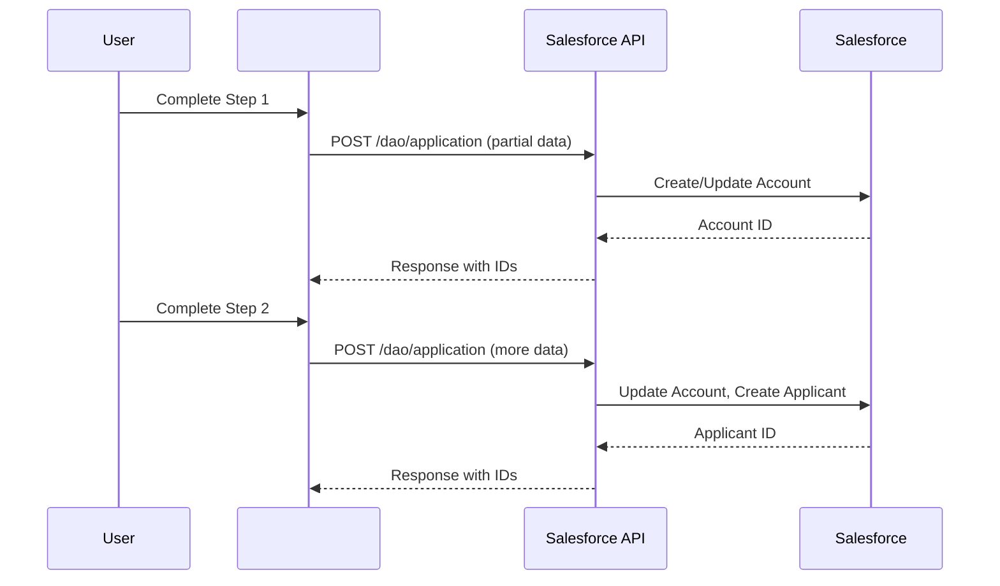

<!-- 
🔴 AI AGENTS: READ FIRST - /docs/01-foundation/data-model.md for correct object names
✅ Correct: ApplicationForm, Applicant, Account (Business), FinancialAccount
❌ Wrong: Application__c, Applicant__c, Loan__c, Business_Relationship__c
-->

# [Workflow Name] -  Workflow

**Workflow Type**: [Account Opening / Loan Application / etc.]  
**Last Updated**: YYYY-MM-DD  
**Purpose**: Document the step-by-step user journey in the external application

---

## 🎯 Overview

This document outlines the [workflow name] process. Choose the appropriate workflow type:

**For Salesforce Users**: See `/docs/03-workflows/salesforce-user-workflow.md` for the complete LWC-based user journey within Salesforce.

**For External Integration**: This template documents the external application workflow for  integration.

**User Type**: [Sole Proprietor / Business Entity / Individual]  
**Estimated Time**: [X minutes]  
**Steps**: [Number of steps]

---

## 📋 Workflow Steps

### Step 1: [Step Name]

**Screen**: [Screen ID or Name]  
**Purpose**: [What this step accomplishes]

**Input Fields:**

| Field Name (API) | Label | Type | Required | Validation | Maps To |
|------------------|-------|------|----------|------------|---------|
| `field_name` | Display Label | Text | Yes | Max 50 chars | Account.Name |
| `another_field` | Another Label | Email | Yes | Valid email | Applicant.Email |

**Business Logic:**
- Rule 1
- Rule 2

**Navigation:**
- **Next**: [Step 2 name]
- **Back**: [Previous step or N/A]
- **Save & Exit**: Allowed

---

### Step 2: [Step Name]

_Repeat structure from Step 1_

---

## 🔄 Data Flow

---

## 📊 Field Mapping Reference

See `/docs/01-foundation/field-mappings.csv` for complete mappings.

## 🔄 Salesforce Integration

**For LWC-based workflows**: See `/docs/03-workflows/salesforce-user-workflow.md` for the complete Salesforce user experience.

**For external API integration**: Use the field mappings below to integrate external application data with Salesforce objects.

---

## ✅ Validation Rules

| Field | Validation | Error Message |
|-------|------------|---------------|
| `email` | Valid email format | "Please enter a valid email address" |
| `phone` | 10-digit US phone | "Phone must be 10 digits" |

---

## 📝 Notes

- Add any special handling notes
- Document edge cases
- List dependencies

---

**Created**: YYYY-MM-DD  
**Last Updated**: YYYY-MM-DD  
**Maintained By**: Development Team

