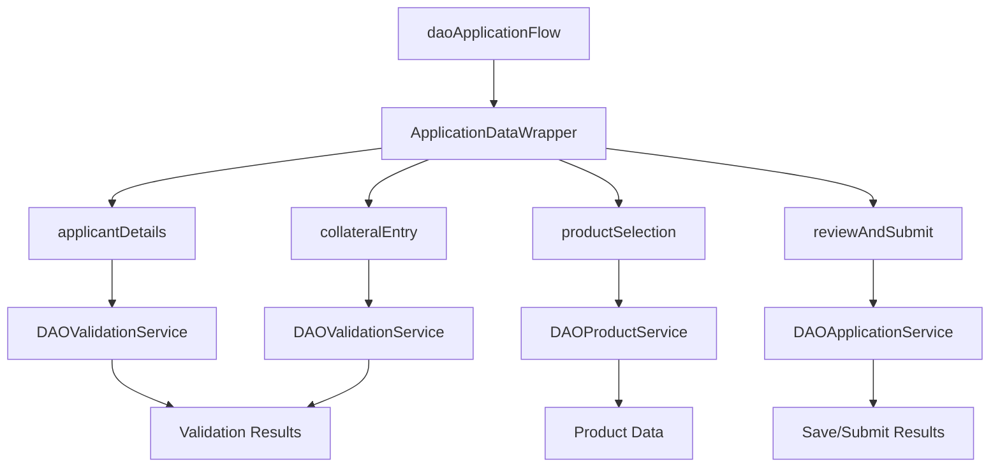

<!-- 
🔴 AI AGENTS: READ FIRST - /docs/01-foundation/data-model.md for correct object names
✅ Correct: ApplicationForm, Applicant, Account (Business), FinancialAccount
❌ Wrong: Application__c, Applicant__c, Loan__c, Business_Relationship__c
-->

# LWC Architecture - Main Street Bank

**Last Updated**: 2025-01-16  
**Purpose**: Document the Lightning Web Component architecture for the deposit account opening solution

---

## 🏗️ Component Architecture Overview

The DAO solution uses a container-child component pattern with a main orchestrator component managing the multi-step workflow.

```
daoApplicationFlow (Container)
├── applicantDetails (Step 1)
├── productSelection (Step 2)
├── collateralEntry (Step 3)
└── reviewAndSubmit (Step 4)
```

---

## 📦 Component Details

### 🎯 daoApplicationFlow (Container Component)

**Purpose**: Main orchestrator for the multi-step application process  
**Responsibility**: Navigation, state management, progress tracking

**Key Features**:
- Progress indicator showing current step
- Dynamic component rendering based on current step
- State management for application data
- Save/resume functionality
- Navigation between steps

**Props**:
- `applicationId` (String): Optional application ID for loading existing applications

**Events**:
- `next`: Move to next step
- `back`: Move to previous step
- `save`: Save current progress
- `submit`: Submit complete application

---

### 👤 applicantDetails (Step 1)

**Purpose**: Collect applicant personal and contact information  
**Responsibility**: Data entry, validation, progress to product selection

**Key Features**:
- Form validation for required fields
- Email and phone format validation
- Real-time field validation
- Auto-save functionality

**Data Fields**:
- First Name, Last Name
- Email, Phone
- Address Information
- Date of Birth
- SSN (encrypted)

---

### 🏦 productSelection (Step 2)

**Purpose**: Present available products and handle selection  
**Responsibility**: Product display, recommendations, selection validation

**Key Features**:
- Dynamic product loading based on applicant profile
- Product recommendations based on applicant data
- Product comparison features
- Eligibility checking

**Integration**:
- `DAOProductService.getAvailableProducts()`
- `DAOProductService.getProductRecommendations()`

---

### 🏠 collateralEntry (Step 3)

**Purpose**: Collect collateral information for secured accounts  
**Responsibility**: Collateral documentation, valuation entry

**Key Features**:
- Multiple collateral item support
- Collateral type selection
- Value entry and validation
- Document upload capability

**Data Fields**:
- Collateral Type (Real Estate, Vehicle, etc.)
- Description
- Estimated Value
- Ownership Information

---

### 📋 reviewAndSubmit (Step 4)

**Purpose**: Final review and submission of application  
**Responsibility**: Data review, validation, submission

**Key Features**:
- Complete application summary
- Final validation check
- Terms and conditions acceptance
- Submission processing

**Validation**:
- Complete data validation
- Business rule checking
- Compliance verification

---

### 📊 applicationStatus (Dashboard)

**Purpose**: Track application progress and status  
**Responsibility**: Status display, progress monitoring

**Key Features**:
- Real-time status updates
- Progress tracking
- Document status
- Next steps guidance

---

## 🔄 Data Flow Architecture

### State Management



### Event Flow

1. **Initialization**: Container loads application data
2. **Step Navigation**: User moves between steps via events
3. **Data Validation**: Each step validates data before proceeding
4. **Auto-Save**: Data is saved at each step
5. **Submission**: Final validation and submission processing

---

## 🎨 UI/UX Patterns

### Design Principles

- **Progressive Disclosure**: Show only relevant information for current step
- **Clear Progress**: Visual progress indicator shows completion status
- **Validation Feedback**: Real-time validation with clear error messages
- **Mobile Responsive**: Works on all device sizes
- **Accessibility**: WCAG 2.1 AA compliance

### Component Styling

- **SLDS Components**: Use Salesforce Lightning Design System
- **Custom CSS**: Minimal custom styling for branding
- **Responsive Layout**: Flexbox and CSS Grid for layouts
- **Theme Support**: Support for light/dark themes

---

## 🔧 Technical Implementation

### Component Communication

```javascript
// Parent to Child (Props)
<c-applicant-details record-id={applicationId}></c-applicant-details>

// Child to Parent (Events)
handleNext(event) {
    this.dispatchEvent(new CustomEvent('next', {
        detail: { applicantData: this.applicantData }
    }));
}
```

### Error Handling

```javascript
// Service call with error handling
saveApplicationData({ applicationData: this.applicationData })
    .then(result => {
        this.showToast('Success', 'Application saved', 'success');
    })
    .catch(error => {
        this.showToast('Error', error.body.message, 'error');
    });
```

---

## 📱 Responsive Design

### Breakpoints

- **Mobile**: < 768px
- **Tablet**: 768px - 1024px  
- **Desktop**: > 1024px

### Layout Adaptations

- **Mobile**: Single column, stacked layout
- **Tablet**: Two column layout where appropriate
- **Desktop**: Full multi-column layout

---

## 🧪 Testing Strategy

### Unit Testing

- Component rendering tests
- Event handling tests
- Data validation tests
- Service integration tests

### Integration Testing

- End-to-end workflow testing
- Cross-component communication
- Data persistence testing

### Performance Testing

- Component load times
- Large data set handling
- Memory usage optimization

---

## 🚀 Deployment Considerations

### Metadata Dependencies

- LWC components
- Apex classes
- Custom objects and fields
- Permission sets
- App permissions

### Configuration

- Component visibility settings
- Page layout assignments
- Permission set assignments

---

## 📚 Related Documentation

- [Data Model](/docs/01-foundation/data-model.md)
- [User Workflows](/docs/03-workflows/salesforce-user-workflow.md)
- [API Integration](/docs/04-implementation/dao-api-quickstart.md)
- [Field Mappings](/docs/01-foundation/field-mappings.md)

---

**Created**: 2025-01-16  
**Last Updated**: 2025-01-16  
**Maintained By**: Main Street bank Development Team
