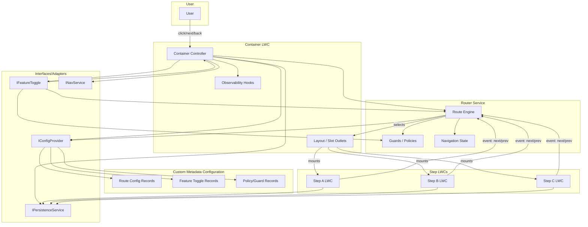
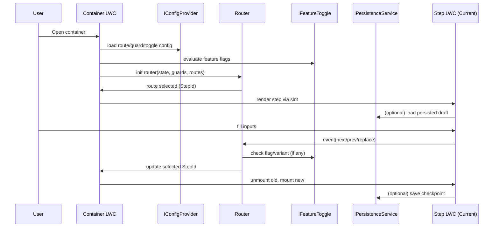
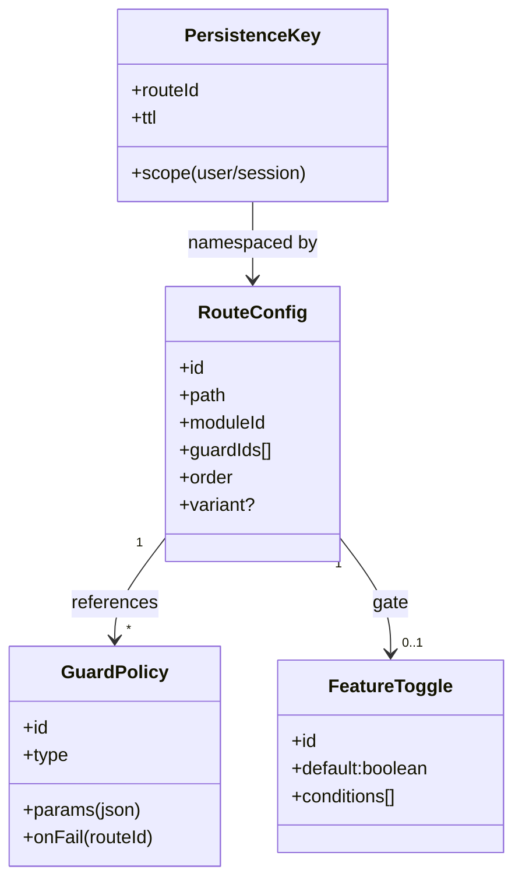

# Architecture Demo Notes (Redacted)

## In a nutshell
- High-level architecture: container, router, step LWCs, custom metadata.
- Interfaces over implementations; guards/policies; feature toggles.
- Composition style: container orchestrates, router resolves, steps are thin views.

---

## Architecture at a Glance
- Container owns composition and DI; not business logic.
- Router is declarative: reads config from metadata, applies guards, renders steps via slots.
- Step LWCs are small, state-light views that emit events; no routing logic inside.
- Custom Metadata is the source of truth for routes, guards, toggles (never secrets).
- Interfaces decouple all boundaries.

## Composition Style
- Declarative route table from metadata → Router decides which Step LWC mounts into the container’s slot.
- DI in container:
  - Provides `IConfigProvider`, `IFeatureToggle`, `INavService`, `IPersistenceService` to children.
  - Observability hooks at edges (navigation, save points).
- Steps communicate via events (`next`, `prev`, `replace`), router updates state, container re-renders.

## Component Overview (Brief)
- Container LWC
  - Orchestrates services (DI), renders slot for current step.
  - Initializes router from metadata and toggles.
  - Provides cross-cutting concerns (loading, toasts, tracing hooks).
- Router Service
  - Builds route table from metadata through `IConfigProvider`.
  - Applies guards/policies; drives navigation state.
  - Not coupled to UI; container subscribes and renders.
- Step LWCs (A/B/C)
  - Focused on display and user input.
  - Emit navigation and save events; optional persistence calls through injected service.
- Services/Interfaces
  - `IConfigProvider`: read route/guard/toggle config.
  - `IFeatureToggle`: evaluate flags/variants.
  - `INavService`: programmatic navigation API.
  - `IPersistenceService`: checkpoint save/load (drafts).
- Custom Metadata Configuration
  - Route definitions, guard policies, feature toggles.
  - Versioning and environment scoping patterns; never store secrets.
- Wizard Step Custom Metadata: Fields
  - `WizardApiName__c` — Identifies which wizard a step belongs to. Steps with the same value are grouped into a single flow.
  - `Order__c` — Numeric sequence used by the router to determine the render order of steps within a wizard.
  - `ComponentBundle__c` — The Lightning Web Component bundle name to mount for this step (e.g., the step LWC).
  - `StepLabel__c` — User-facing label for the step shown in UI elements (headers, progress indicators).
  - `Skippable__c` — Whether the step can be bypassed by the router/UX under certain conditions (e.g., optional info).
  - `ValidatorClasses__c` — Comma- or semicolon-delimited Apex class names to validate step readiness or completion.
  - `HelpText__c` — Short guidance text displayed to users to clarify what to provide on this step.
- Persistence Service (optional)
  - Save/restore draft payloads keyed by route/user/session.
- Observability Hooks
  - Emit minimal telemetry for navigation and persistence outcomes.

## Architectural Decisions (High-Level)
- Interfaces-first: All boundaries defined via interfaces to prevent tight coupling.
- Declarative routing: Route table lives in metadata; router is stateless aside from navigation.
- Guarded navigation: Guards/policies configured via metadata for consistency.
- Feature flag gating: Enable incremental rollout and canary behavior.
- Persistence optionality: Steps opt-in; persistence behind an interface.

---

## Diagram: Component/Composition

## Diagram: Runtime Sequence (Happy Path)

## Diagram: Data Model (Abstract)

---

